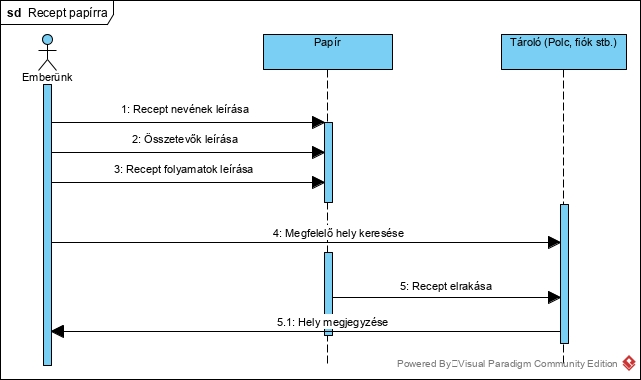

# Recept oldal

Funkcionális specifikáció leírása
---

1. Vezetői összefoglaló (bevezető)  
   A Debreceni szakács képző intézet áltált megrendelt alkalmazást,  
   melyet webes felületen szeretnénk megvalósítani,előtérbe helyezve az  
   egyszerűséget. 
   Minden felhasználói elvárást kielégítő recept oldal létrehozását  
   tervezzük fejlesztő csapatunkkal. Eddigi oldalak megoldásait és saját  
   ötleteinket használva egy minden eddiginél másabb, jobb oldalt szeretnénk 
   megvalósítani.  
   Célunk egy olyan weboldal létrehozása, amelyet minden korosztály szívesen  
   használ. A fiatalabbak könnyedén találhatnak számukra új, de másoknak  
   jólbevált recepteket, és segítséget kérhetnek ha elakadnának. Az idősebb  
   korosztály megoszthatja másokkal saját, az évek alatt tökéletesített,  
   receptjeit, és új praktikákat tanulhat, megismerkedhet új receptekkel. 

   Elképzeléseink szerint mind MacOS-en mind linuxon ugyan úgy nézne ki és 
   működne a program mint windowson. 
   Google chrome-on, firefox-on és a explorer-en is ugyanazt a támogatást  
   kapná, így bárki nyugodtan tudja használni, függetlenül a böngészőjétől. 
   A program front end része angulárban íródna meg, ez egy nagy könnyebbséget 
   tud adni a fejlesztőnek, áttekinthetőbb a kód, a weboldal modernebb, több  
   és jobb támogatást használhat. 
   A backend *TODO KERETRENDSZER* keretrendszerben lenne írva, objektum 
   orientált szemléletben, így elkülönitve a metódusokat, áttekinthető 
   kódot kapunk. Ennek köszönhetően könnyen lehet módositani a programot 
   arra amit a felhasználó megkiván. 
    
2. Jelenlegi helyzet 
   A projekttervét elkezdtük kidolgozni, hogy a határidőkre megfelelően be 
   tudjuk fejezni a dokumentációkat. A feladatkörök nagyvonalú kiosztása,  
   egy megbeszélés keretein belül megtörtént.  
   A feladatok kiosztását a `TRELLO` nevű alkalmazásban vezetjük, a verzió  
   követésért a `GITHUB` a felelős, ide töltjük fel a szoftver _step-by-step_  
   változatait. Ennek köszönhetően bárhol és bármelyik csapattag tudja  
   módosítani a szoftvert. 
   Ahogy azt már fentebb említettem a projektben külön kezeljük a frontendet 
   a backendtől amit `ANGULAR`-ban irunk meg.  
   A backend a http kérésekkel kommunikál a frontenddel és objktum 
   orientáltan `SLIM` keretrendszerben írunk meg. 
   A program egy fő oldalból áll aminek a tartalmát cserélgetjük. 

3. Vágyálom rendszer  
   Kiindulva abból, hogy a főzés magában is egy hosszadalmas munka, olyan  
   weboldalt álmodtunk meg amiben nem kerül sok időbe egy recept elérése.  
   Tudva azt, hogy nem feltétlen informatikusok fogják használni a programot,  
   egy könnyedén használható alkalmazást szeretnénk megteremteni.  
   A felhasználók azonosítására `MySQL` adatbázist fogunk használni.  
   Egy rövid regisztráció után a felhasználót username-mel, password-mel és  
   DisplayName-mel felvisszük az adatbázisba a password-öt titkosítjuk hogy  
   ne lehessen _'könnyedén'_ feltörni. Reményeink szerint a felhasználók  
   láthatják egymást egymást a rendszerben, keresgélhetnek egymás *PUBLIKUS*  
   receptjei között és a nekik szimpatikusakat elmenthetik a saját tárolójukba. 
   Oldalunk megalkotásával minden korosztály számára a könnyen használhatóság 
   a célunk. Ehhez hozzásegít a letisztult dizájn és az egyértelmű címszavak,  
   valamint a chat funkció, mellyel bármikor kérhet bárki segítséget.  
    Elképzelésünk szerint a weboldalra érkező vendégeket egy olyan felület 
   fogadja majd amelyen rögtön regisztrálhatnak, vagy a már meglévő fiókjukba  
   beléphetnek. 
   Bejelentkezés után válnak majd elérhetővé az oldal további funkciói a   
   felhasználó számára.  
   A regisztráció után a felhasználó minden elérhető funkciót használhat majd. 
   Ezen fő funkciók a következők lesznek: recept keresés, saját fiók kezelése,  
   chatelés.  

4. Jelenlegi üzleti folyamatok 
   Jelenleg nem sok receptoldalt van a interneten, így a háziasszonyok  
   egyik nagy álmát valósítjuk meg ezzel az alkalmazással. Mivel mi ezt a  
   komolyan csináljuk elég nagy támogatást szeretnénk hozzá adni, amivel a  
   felhasználóknak szeretnénk egy amahabiztos hátteret adni. Ha valami  
   gondba ütköznek vagy valami kérdésük van egy beépített chaten keresztül  
   tudják elérni a `support`-ot akik mindenben segítenek nekik.  

  Eddigi megadott lehetőségek:  
  * Recept elmentése:
    * Leírni papírra és elrakni
     
    * Begépelni egy dokumentumba és elmenteni a saját  
      számítógépünkön
    * Begépelni egy dokumentumba és felhőbe elmenteni
  * Új recept keresése:
    * Receptkönyv használata
    * Receptújság használata
    * Interneten történő böngészés
    * Tv-s főzőműsor nézése

	
	A bejelentkezés folyamata a következő: 
	A user rákattint a bejelentkezés gombra ezzel elirányítva a bejelentkezési 
	felületre. Ezen a felületen lehetősége van az e-mail címét vagy a felhasználó 
	nevét és a jelszavát megadni. Ha mindezt az előzetesen elmentett SQL adatbázisnak  
	megfelelően írja be akkor bejelentkezhet. Ha nem akkor feltűnik a lehetőség,  
	hogy egy jelszó emlékeztető e-mailt küldjön a user magának. Ebben az emlékeztető  
	emailben vagy a jelszavát változtathatja meg vagy megkapja a jelszavát leírva.  
	Ha ezen is túl van nagy valószínűséggel tudni fogja a jelszavát és bejelentkezhet. 
	
	
	
	 

	
	A regisztráció folyamata a következő:  
	Amikor a user rálép az oldalra fel lesz kínálva neki a lehetőség, hogy  
	bejelentkezzen vagy regisztráljon. A regisztrációra kattintva megnyílik 
	egy regisztrációs felület. Ezen a felületen megadhatja felhasználónevét, 
	e-mail címét, jelszavát és jelszó emlékeztetőjét. Egyik adat se egyezhet 
	meg az SQL adatbázisban szereplő bármelyik névvel vagy e-mail címmel. A  
	felhasználónév nem kezdődhet alsóvonással, számmal és nem tartalmazhat  
	ékezetes betűt. A jelszónak tartalmaznia kell nagybetűt, kisbetűt, számot  
	de nem számsort és nem lehet a felhasználónév. Illetve legalább nyolc karakter 
	hosszúnak kell lennie. A bejelentkezés gombra kattintva leellenőrizzük az  
	adatokat, hogy megfelelőek-e és ha minden rendben van velük akkor a regisztráció  
	megtörtént és az adatokat felvesszük az SQL adatbázisba. 
	 
	 

5. Igényelt üzleti feladatok  
   A program bárki számára elérhet, ehhez nincs máshoz szükség csak egy  
   internetre kapcsolódni tudó alkalmazáshoz, internetre és megfelelő  
   verziójú böngészőre. A program fő oldalán egy login oldal szerepel, ahol 
   egy felhasználó név és jelszó megadása után könnyedén érkezhetünk a  
   receptek oldalra. Amennyiben nem rendelkezik account-tal a felhasználó,  
   egy gomb segitségével a program átnavigálja őt a regisztráció oldalra,  
   majd egy rövid regisztráció után vissza is dobja a bejelentkezéshez.  
   A bejelentkezés után a receptek között bogarászhatunk vagy átmehetünk a 
   recept feltöltés fülre vagy a saját receptjeim fülre. 

  * Főoldal kezdeti állapota 
     * Regisztrációs lehetőség 
       Új felhasználók számára a regisztráció lehetősége ezen ponton  
       a _Tovább a regisztráció!_ gombra kattintva lesz lehetőség.
     * Bejelentkezési lehetőség  
       Már korábban regisztrált felhasználóként ezen a ponton  
       a _Tovább a bejelentkezéshez!_ gombra kattintva lesz lehetősége a  
       felhasználónak belépni a saját fiókjába.
  * Sikeres belépés után 
     * A felhasználó saját receptjeit szerkesztheti
        * Feltöltött recept megtekintése
        * Új recept feltöltése
           * Publikus formában
           * Rejtett formában
        * Már feltöltött recept szerkesztése
        * Már feltöltött recept törlése
     * A felhasználó új recepteket kereshet
        * Megfelelő keresőszót beírva
        * Kategóriák szerint
        * Érzékenység szerint
     * Más felhasználók által feltöltött recepteket értékelhet,  
       kérdéseket tehet fel
        * 1-től 10-ig tartó pontozással
        * Hozzászólással
     * Chatelést kezdeményezhet
        * Más felhasználóval
        * Fejlesztőkkel
     * A felhasználó szerkesztheti profilját
        * Új profilkép feltöltése
        * E-mail cím megváltoztatása
        * Felhasználónév megváltoztatása
        * Jelszó megváltoztatása

